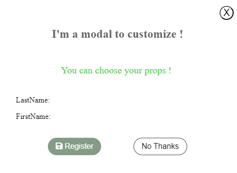

# Modal

Le composant Modal est un composant React réutilisable qui permet d'afficher une fenêtre modale avec un contenu personnalisable.

## Installation

Pour installer le package npm, utilisez la commande suivante :

```
npm i banby-modal-customize-react
```

## Utilisation

Pour utiliser le composant Modal dans votre projet, importez-le à partir du package npm et utilisez-le dans votre code comme tout autre composant React :

```javascript
   import React from "react";
   import Modal from "modal-plugin";

   const App = () => {
     const handleOpenModal = () => {
       // Logique pour ouvrir le modal
     };

     const handleCloseModal = () => {
       // Logique pour fermer le modal
     };

     return (
       <div>
         <button onClick={handleOpenModal}>Ouvrir le modal</button>
         <Modal isOpen={true} onClose={handleCloseModal}>
           <h2>Contenu du modal</h2>
           <p>Ceci est un exemple de contenu personnalisé pour le modal.</p>
         </Modal>
       </div>
     );
   };

   export default App;

```

## Props

Le composant Modal accepte les props suivantes :

- `isOpen` (booléen) : Indique si la modal doit être ouverte ou fermée.
- `onClose` (fonction) : Fonction de rappel appelée lorsque l'utilisateur ferme la modal.
- `modalStyle` (objet) : Un objet contenant des styles en ligne pour la modal.
- `modalClassName` (chaîne) : Une chaîne contenant des noms de classe CSS pour la modal.
- `modalTitle` (chaîne) : Une chaîne contenant le titre de la modal.
- `firstName` (chaîne) : Une chaîne contenant le prénom à afficher dans la modal.
- `lastName` (chaîne) : Une chaîne contenant le nom à afficher dans la modal.
- `onSave` (fonction) : Fonction de rappel appelée lorsque l'utilisateur clique sur le bouton "Enregistrer".
- `onCancel` (fonction) : Fonction de rappel appelée lorsque l'utilisateur clique sur le bouton "Non merci".

## Exemple de d'utilisation 

Voici un exemple d'utilisation du composant Modal pour afficher les données d'un formulaire et permettre à l'utilisateur d'enregistrer ou d'annuler les modifications :


Assurez-vous de remplacer `'your-npm-package-name'` par le nom réel de votre package npm dans l'exemple d'utilisation du composant Modal. m à j

```javascript
import React, { useState } from "react";
import Modal from 'your-npm-package-name';
import Form from "./Form"; // Votre formulaire

// ... Votre code ici


const App = () => {
  const [modalOpen, setModalOpen] = useState(false);
  const [formData, setFormData] = useState({});

  const handleOpenModal = () => {
    setModalOpen(true);
  };

  const handleCloseModal = () => {
    setModalOpen(false);
  };

  const handleFormData = (data) => {
    setFormData(data);
  };

  const handleSave = () => {
    // code pour enregistrer les données du formulaire
    console.log("Données du formulaire enregistrées :", formData);
    handleCloseModal();
  };

  const handleCancel = () => {
    // code pour annuler les modifications du formulaire
    console.log("Modifications du formulaire annulées");
    handleCloseModal();
  };

  return (
    <div className="app">
        
      {/*<Form handleFormData={handleFormData} /> votre component */}
      <button className="open-modal-button" onClick={handleOpenModal}>
        Open Modal
      </button>
      <Modal
        isOpen={modalOpen}
        onClose={handleCloseModal}
        modalStyle={{ backgroundColor: "white" }}
        modalClassName="my-custom-modal-class"
        modalTitle="My Custom Modal Title"
        firstName={formData.firstName}
        lastName={formData.lastName}
        onSave={handleSave}
        onCancel={handleCancel}>
        {/* Contenu personnalisable de la modal */}
      </Modal>
    </div>
  );
};

export default App;
```

Dans cet exemple, nous avons un composant `Form` qui gère les données du formulaire et une fonction `handleFormData` qui est passée en tant que prop au composant `Form` pour recevoir les mises à jour des données du formulaire. Lorsque l'utilisateur saisit des données dans le formulaire, le composant `Form` appelle la fonction `handleFormData` pour mettre à jour l'état `formData` dans le composant `App`.

Nous avons également deux fonctions, `handleSave` et `handleCancel`, qui sont passées en tant que props aux boutons "Enregistrer" et "Non merci" de notre composant Modal. Ces fonctions sont appelées lorsque l'utilisateur clique sur les boutons pour enregistrer ou annuler les modifications du formulaire.

Enfin, nous passons les données du formulaire en tant que props à notre composant Modal pour afficher les informations dans la modal.

---
## Licence

Ce package est distribué sous la [LICENCE](https://opensource.org/licenses/MIT) MIT. Veuillez consulter le fichier LICENSE pour plus d'informations.


<div style="text-align: center; width: 50%">
  