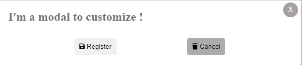
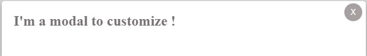
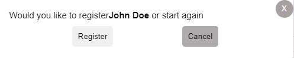

# Modal

Le plugin Modal vous permet d’afficher une modal avec un message de confirmation après la création d’un employé dans votre projet React.

## Installation

Pour installer le plugin Modal, vous pouvez utiliser npm ou yarn pour ajouter le package à votre projet:

```bash
npm install --save banby-modal-customize-react

```
ou
```bash
yarn add banby-modal-customize-react

```
## Utilisez la modal :
```jsx
import React, { useState } from "react";
import Modal from "chemin-vers-la-modal-externe";

const NomComposantAuChoix = () => {
  const [modalOpen, setModalOpen] = useState(false);

  // ... Gérez les fonctions de gestion de la modal (handleOpenModal, etc.)

  return (
    <div>
      <button onClick={handleOpenModal}>Ouvrir la Modal</button>
      {modalOpen && (
        <Modal
          isOpen={modalOpen}
          onClose={handleCloseModal}
          modalTitle="Titre de la Modal"
          showButtons={true}
          onSave={handleSave}
          onCancel={handleCancel}
        >
          {/* Contenu additionnel de la modal */}
        </Modal>
      )}
    </div>
  );
};

export default NomComposantAuChoix;
```

## Modal Externe Personnalisable - Documentation

La modal externe personnalisable vous permet d'ajuster son apparence et son comportement en fonction de différentes options. Voici un aperçu des possibilités et du code pour chaque option :

## Options et Utilisation

## Props

Le composant Modal accepte les props suivantes :

- `isOpen` (booléen) : Indique si la modal doit être ouverte ou fermée.
- `onClose` (fonction) : Fonction de rappel appelée lorsque l'utilisateur ferme la modal.
- `modalStyle` (objet) : Un objet contenant des styles en ligne pour la modal.
- `modalClassName` (chaîne) : Une chaîne contenant des noms de classe CSS pour la modal.
- `modalTitle` (chaîne) : Une chaîne contenant le titre de la modal.
- `firstName` (chaîne) : Une chaîne contenant le prénom à afficher dans la modal.
- `lastName` (chaîne) : Une chaîne contenant le nom à afficher dans la modal.
- `onSave` (fonction) : Fonction de rappel appelée lorsque l'utilisateur clique sur le bouton "Enregistrer".
- `onCancel` (fonction) : Fonction de rappel appelée lorsque l'utilisateur clique sur le bouton "Non merci".
- `showButtons` (booléen) : Indique l'affichage des boutons.
- `actionLabel `(booléen) : qui indique si l'action est faite ou non.

---
## Affichages de la modal 
## Exemples à suivre en selectionnant les Props de votre choix :

### 1 . Avec Titre + boutons pour utilisation d'un formulaire:
Pour afficher la modal avec un titre et des boutons "Enregistrer" et "Annuler", utilisez les propriétés `modalTitle` et `showButtons` :
(props actionLabel optionnel pour la validation d'un form)


```jsx

<Modal
  isOpen={modalOpen}
  onClose={handleCloseModal}
  modalTitle="Modal avec Titre et Boutons"
  showButtons={true}
  onSave={handleSave}
  onCancel={handleCancel}
  //actionLabel={actionLabel}
>
</Modal>
```

### 2. Titre seul :  utilisez la propriété modalTitle avec showButtons à false :

```jsx
<Modal
  isOpen={modalOpen}
  onClose={handleCloseModal}
  modalTitle="Titre de la Modal"
  showButtons={false}
>
</Modal>
```



### 2. Titre +  autres Props (firsTname & lastNale) par exepmle sans buttons: 

```jsx
<Modal
  isOpen={modalOpen}
  onClose={handleCloseModal}
  firstName="john" // votre choix
  lastName="Doe" // votre choix
  modalTitle="Titre de la Modal"
  showButtons={false}
>
</Modal>
```


### 2. Autres Props (firsTname & lastName) par exemple + boutons: 

```jsx
<Modal
  isOpen={modalOpen}
  onClose={handleCloseModal}
  firstName="john" // votre choix
  lastName="Doe" // votre choix
  modalTitle="Titre de la Modal"
  showButtons={false}
>
</Modal>
```



```
## Licence

Ce package est distribué sous la [LICENCE](https://opensource.org/licenses/MIT) MIT. Veuillez consulter le fichier LICENSE pour plus d'informations.

## Support
Si vous rencontrez des problèmes avec ce plugin ou si vous avez des questions ou des suggestions, veuillez nous contacter à l’adresse support@modal-plugin.com.
